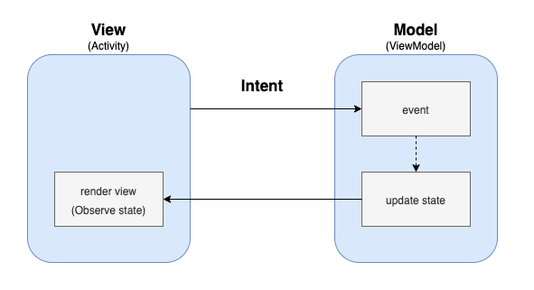
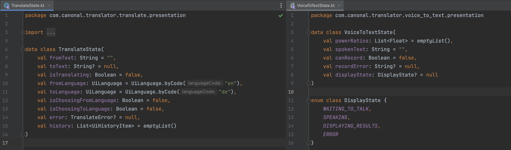
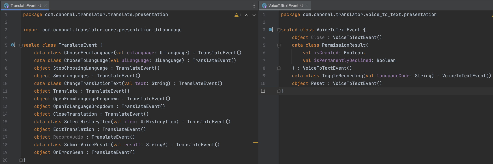

<h1 align="center">Translator (KMM)</h1> 

  
A translator app built with Kotlin Mobile multiplatform and MVI based on Philipp Lackner's <a href="https://pl-coding.com/building-industry-level-multiplatform-apps-with-kmm">KMM course</a>. After completing the course I made several improvements by adding navigation library, common resource library, localization for turkish language and more test cases. You can find more detailed information about the overall app structure and my improvements.

 

  
  
   

## Screeshots :camera_flash:

### Android

### iOS

## Tech stack & Libraries :books:
- [Kotlin Mobile Multiplatform](https://kotlinlang.org/lp/mobile/) - create navite apps by sharing common code between iOS and Android apps.
  - [Kotlin](https://kotlinlang.org)
  - [Swift](https://developer.apple.com/swift/)
- [Jetpack Compose](https://developer.android.com/jetpack/compose) - is the modern toolkit recommended by Android for building native user UI. It streamlines and speeds up the development process by allowing for the creation of powerful and intuitive UI with less code and easy-to-use Kotlin APIs.
- [SwiftUI](https://developer.apple.com/xcode/swiftui/) - is a declarative UI toolkit created by Apple for designing responsive user interfaces for iOS and macOS. With its concise and expressive syntax, it makes it easy to create powerful and engaging UI with minimal code.
- [Navigation Destinations](https://github.com/raamcosta/compose-destinations) - Easy to use navigation library for Jetpack Compose
- [Android Hilt](https://developer.android.com/training/dependency-injection/hilt-android) - Dependency Injection Library for Android
- [Coroutines](https://developer.android.com/kotlin/coroutines) - is a concurrency design pattern that you can use on Android to simplify code that executes asynchronously.
- [Flow](https://developer.android.com/kotlin/flow) - is a type that can emit multiple values sequentially. They are built on top of coroutines and can provide multiple values
- [Ktor](https://ktor.io) - Create asynchronous client and server applications. Anything from microservices to multiplatform HTTP client apps in a simple way. Ktor is built from using Kotlin and Coroutines.
- [SQLDelight](https://cashapp.github.io/sqldelight/2.0.0-alpha05/multiplatform_sqlite/) - Database from multiplatform. SQLDelight generates typesafe kotlin APIs from your SQL statements.
- [Coil Compose](https://coil-kt.github.io/coil/compose/) - is a library for loading images on Android, utilizing Kotlin Coroutines for efficient and responsive performance.
- [Detekt](https://github.com/detekt/detekt) - Static code analysis for Kotlin
- [moko-resources](https://github.com/icerockdev/moko-resources) - is a multiplatform library that provides access to the resources on macOS, iOS, Android the JVM and JS/Browser with the support of the default system localization.
- Testing
  - [Turbine](https://github.com/cashapp/turbine) - A small testing library for kotlinx.coroutines Flow
  - [AssertK](https://github.com/willowtreeapps/assertk) - assertk is a fluent assertion library. Since assertJ is written in Java, it cannot be used to test common code. Thus, we need the Kotlin version of assetJ which is assertk.
  - [Test runner](https://developer.android.com/jetpack/androidx/releases/test)
  - [Test rules](https://developer.android.com/jetpack/androidx/releases/test)

In the shared module, only the libraries written in Kotlin are allowed to use. For example Retrofit is not compatible for the shared module. 

## Architecture :straight_ruler:

The app is built with MVI pattern. Here, we have a shared viewmodel that holds the business logic. Thanks to the KMM, we implement the viewmodel once in common code and use it both in Android and iOS platforms. Optionally, wrapper viewmodels are created for Android and in iOS to make the use of coroutine scopes easier.

### MVI (Model-View-Intent)

  

MVI stands for Model-View-Intent, which is a pattern for structuring Android applications. The pattern emphasizes separating the business logic and the data from the UI, and using a unidirectional data flow to manage the state of the application. This can make the code more organized, testable, and maintainable.

- **Model**: The Model represents the data or state of the application. It is responsible for storing and managing the data that is displayed in the UI. The Model is typically implemented as a set of data classes that represent the various types of data used in the application. It can also include logic for modifying and querying the data, such as validation and persistence. The Model is typically unaware of the View and does not interact with it directly.

  
  Shared Translate Model and VoiceToText Model

- **View**: The View represents the visual representation of the data. It is responsible for displaying the data from the Model in the UI and for handling user interactions. The View is typically implemented as an Android activity or fragment. The View is also responsible for transforming the user's actions into intents/events and sending them to the Presenter.
- **Intent**: The Intent represents the user's intentions or actions. It is a way to communicate the user's intentions to the Presenter. The Intent is typically implemented as a simple data class or sealed class, which holds the type of the intent and any additional data needed to handle the intent. The View is responsible for transforming the user's actions into intents and sending them to the Presenter. The Presenter will then handle the intent and update the Model accordingly, and the View will be updated with the new data.

  
  Shared Translate Intent and VoiceToText Intent

  
